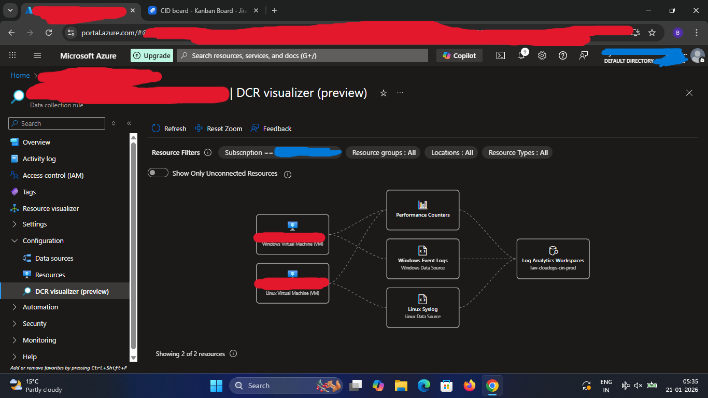

# Monitoring & Alerts

## Log Analytics Workspace
* Central Workspace created in shared resource group
* Connected both Windows and Linux VMs

## Data Collection Rules (DCR)
* Single DCR applied to both Windows and Linux VMs
* Collected:
   - Performance Counters (CPU, Memory)
   - Windows Events Logs
   - Linux Syslog

* Centralized logs sent to Log Analytics Workspace

## Metrics & Logs
* CPU Utilization
* Performance Metrics
* Monitored VM hosting Nginx for CPU and availability
* Alerts help detect web server impact due to VM issues

## Alerts Configured
* VM Down alert
* High CPU utilization alert
* Alerts configured using Azure Monitor
* Notifications triggered on threshold breach

## Benefit
Centralized monitoring enables proactive issue detection and faster incident response.

