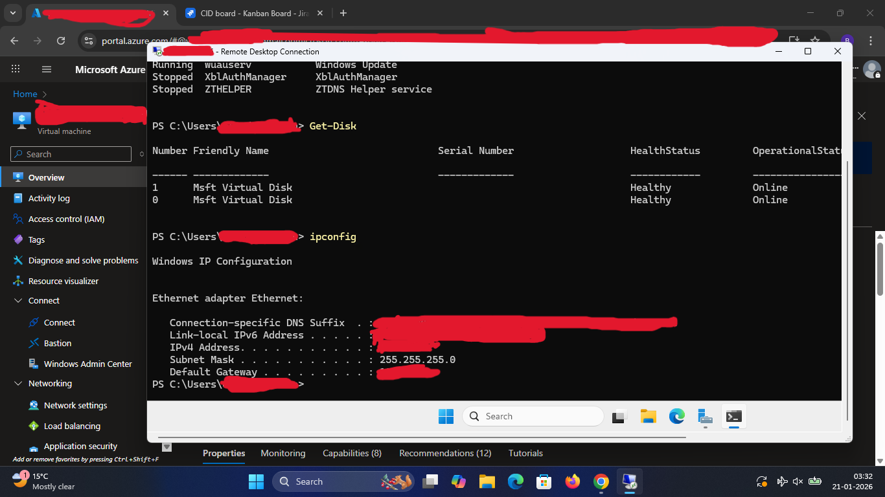

Md


# Powershell Operations - Azure Virtual Machines


## Overview

Powershell was used to manage and operate both Windows and Linux Virtual Machines in Azure, 

demonstrating cross-platform administration and automation capabilities.


## Azure Powershell

* Used  AZ Powershell module resource management
* Authentication using Azure CLI / Powershell Login


##Azure Powershell Operations VM Operations (End-to-End)


```powershell

# ==============================
# Authenticate & Subscription
# ==============================

# Authenticate to Azure
Connect-AzAccount

# Verify active subscription context
Get-AzContext

# ==============================
# Virtual Machine Management
# ==============================

# List all virtual machines
Get-AzVM

# Get VM power state
Get-AzVM-Status

# ==================================
# Windows Virtual Machine Operations
# ==================================

# View Window services
Get-Service
# View running processes
Get-Process
# View disk
Get-Disk
# Network Validation
ipconfig



# ===================================
# Linux VM Operations via PowerShell 
# ===================================

# Connect to Linux VM using SSH from PowerShell
ssh <username>@<linux-vm-public-ip>

# ===================================
# Nginx Validation (Linux VM)
# ===================================

# Verify Nginx service status
sudo systemctl status nginx
# Restart Nginx if required
sudo systemctl restart nginx
# Enable Nginx on boot
sudo systemctl enable nginx

# ===================================
# VM Lifecycle Management
# ===================================

# Stop VM to reduce cost
Stop-AzVM -ResourceGroupName <resource-group-name> -Name <vm-name> -Force
# Start VM
Start-AzVM -ResourceGroupName <resource-group-name> -Name <vm-name>

```

> Note: Sensitive Information such as subscription IDs, usernames and IP addresses are intentionally omitted for security reasons.

## Operational Summary
- Managed Azure VMs without relying on the Azure Portal
- Performed cross-platform administration using a Single Powershell interface
- Validated application availability(Nginx) through CLI-based operations

